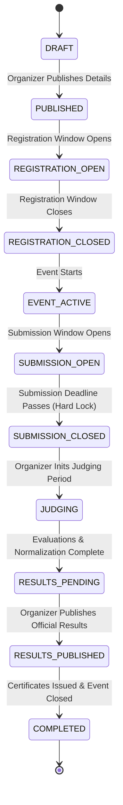

# ENTERPRISE HACKATHON PLATFORM — SYSTEM ARCHITECTURE & MASTER INSPECTION REPORT

**Document ID:** ARCH-INSPECT-001  
**Platform:** Next.js Modular Monolith with Neon PostgreSQL, Prisma ORM, Strict RBAC, Independent Judging & AI Calibration  
**Status:** Greenfield Inspection Completed — Architecture Formalized  
**Specification Reference:** Master Prompt Sections 0–55  

---

## A. CURRENT ARCHITECTURE

An exhaustive inspection of the workspace (`c:\Users\GOWTHAMGOWRI\Desktop\Dogfood`) was conducted prior to code execution.

| Dimension | Current Workspace State | Architecture Specification Target |
| :--- | :--- | :--- |
| **Workspace Directory** | Empty directory (0 files, 0 folders) | Next.js App Router Modular Monolith |
| **Toolchain Available** | Node.js v24.12.0, npm 11.6.2, Git 2.52.0 | Node.js >= 18 LTS, npm/npx, Git |
| **Current Folders** | None | `src/app`, `src/components`, `src/modules`, `src/lib`, `src/types`, `src/prisma`, `docs/` |
| **Current Technologies** | None initialized | Next.js 14+ (App Router), TypeScript (strict), Tailwind CSS, Prisma ORM, Zod |
| **Current Database** | None configured | Neon PostgreSQL via pooled `DATABASE_URL` and unpooled `DIRECT_URL` |
| **Current Authentication** | None configured | Stateless HTTP-only Session / JWT with Argon2/bcrypt password hashing, server-side RBAC |
| **Current APIs** | None configured | REST Route Handlers at `/api/v1/*` using Controller-Service-Repository pattern |
| **Current UI** | None configured | Server-rendered public discovery + Role-specific workspaces (Participant, Organizer, Judge, Admin) |

---

## B. IMPLEMENTATION STATUS BY MODULE

Status categories: `NOT_STARTED`, `IN_PROGRESS`, `IMPLEMENTED`, `TESTED`, `VERIFIED`.

| Module | Purpose | Database | Repository | Service | API | UI | Authz | Tests | Status |
| :--- | :--- | :---: | :---: | :---: | :---: | :---: | :---: | :---: | :---: |
| **auth** | User registration, login, session, password management | ⚪ | ⚪ | ⚪ | ⚪ | ⚪ | ⚪ | ⚪ | `NOT_STARTED` |
| **users** | User profile, platform roles, system settings | ⚪ | ⚪ | ⚪ | ⚪ | ⚪ | ⚪ | ⚪ | `NOT_STARTED` |
| **hackathons** | Lifecycle, dates, eligibility, limits, configuration | ⚪ | ⚪ | ⚪ | ⚪ | ⚪ | ⚪ | ⚪ | `NOT_STARTED` |
| **tracks** | Tracks categorization within hackathons | ⚪ | ⚪ | ⚪ | ⚪ | ⚪ | ⚪ | ⚪ | `NOT_STARTED` |
| **problem-statements** | First-class problem statements linked to tracks | ⚪ | ⚪ | ⚪ | ⚪ | ⚪ | ⚪ | ⚪ | `NOT_STARTED` |
| **registrations** | Participant application, approval, criteria checks | ⚪ | ⚪ | ⚪ | ⚪ | ⚪ | ⚪ | ⚪ | `NOT_STARTED` |
| **teams** | Team creation, join codes, invites, member caps | ⚪ | ⚪ | ⚪ | ⚪ | ⚪ | ⚪ | ⚪ | `NOT_STARTED` |
| **projects** | Project metadata, repository, demo URLs, tech stack | ⚪ | ⚪ | ⚪ | ⚪ | ⚪ | ⚪ | ⚪ | `NOT_STARTED` |
| **submissions** | Versioned submissions, deadline locks, artifacts | ⚪ | ⚪ | ⚪ | ⚪ | ⚪ | ⚪ | ⚪ | `NOT_STARTED` |
| **judges** | Judge profiles, track expertise, conflicts, workload | ⚪ | ⚪ | ⚪ | ⚪ | ⚪ | ⚪ | ⚪ | `NOT_STARTED` |
| **assignments** | Balanced assignment engine, conflict avoidance | ⚪ | ⚪ | ⚪ | ⚪ | ⚪ | ⚪ | ⚪ | `NOT_STARTED` |
| **rubrics** | Versioned rubrics, weighted criteria definitions | ⚪ | ⚪ | ⚪ | ⚪ | ⚪ | ⚪ | ⚪ | `NOT_STARTED` |
| **evaluations** | Immutable human evaluation records, feedback | ⚪ | ⚪ | ⚪ | ⚪ | ⚪ | ⚪ | ⚪ | `NOT_STARTED` |
| **scoring** | Raw, weighted, criterion aggregation | ⚪ | ⚪ | ⚪ | ⚪ | ⚪ | ⚪ | ⚪ | `NOT_STARTED` |
| **normalization** | Trimmed-mean, Z-score, min-max standardizations | ⚪ | ⚪ | ⚪ | ⚪ | ⚪ | ⚪ | ⚪ | `NOT_STARTED` |
| **results** | Final rankings, track-level winners, official awards | ⚪ | ⚪ | ⚪ | ⚪ | ⚪ | ⚪ | ⚪ | `NOT_STARTED` |
| **leaderboard** | Published leaderboard views, private previews | ⚪ | ⚪ | ⚪ | ⚪ | ⚪ | ⚪ | ⚪ | `NOT_STARTED` |
| **voting** | Community "People's Choice" voting with rate limits | ⚪ | ⚪ | ⚪ | ⚪ | ⚪ | ⚪ | ⚪ | `NOT_STARTED` |
| **comments** | Project discussion threads & moderation | ⚪ | ⚪ | ⚪ | ⚪ | ⚪ | ⚪ | ⚪ | `NOT_STARTED` |
| **attendance** | Check-in sessions, participant attendance logs | ⚪ | ⚪ | ⚪ | ⚪ | ⚪ | ⚪ | ⚪ | `NOT_STARTED` |
| **certificates** | Issue, verify, revoke verifiable certificates | ⚪ | ⚪ | ⚪ | ⚪ | ⚪ | ⚪ | ⚪ | `NOT_STARTED` |
| **notifications** | In-app notification center | ⚪ | ⚪ | ⚪ | ⚪ | ⚪ | ⚪ | ⚪ | `NOT_STARTED` |
| **audit** | Immutable audit logs for all critical mutations | ⚪ | ⚪ | ⚪ | ⚪ | ⚪ | ⚪ | ⚪ | `NOT_STARTED` |
| **ai-jury** | Artifact analysis, code inspection, criterion scores | ⚪ | ⚪ | ⚪ | ⚪ | ⚪ | ⚪ | ⚪ | `NOT_STARTED` |
| **ai-comparison** | Pairwise human-AI error delta and confidence store | ⚪ | ⚪ | ⚪ | ⚪ | ⚪ | ⚪ | ⚪ | `NOT_STARTED` |
| **ai-calibration** | Versioned datasets, training/validation, MAE/RMSE | ⚪ | ⚪ | ⚪ | ⚪ | ⚪ | ⚪ | ⚪ | `NOT_STARTED` |

---

## C. ARCHITECTURAL CONFLICTS & ANTI-PATTERNS TO GUARD AGAINST

Because this is a greenfield initialization, zero legacy anti-patterns are present. However, to guarantee an enterprise-grade standard throughout development, the following 10 strict architectural prohibitions are enforced:

1. **Monolith Boundary Violations (No Microservices / Standalone Backends):**
   * *Violation:* Introducing standalone Express, NestJS, or microservice containers.
   * *Enforcement:* Strictly use the Next.js Modular Monolith architecture. All domains live under `src/modules/` and Route Handlers under `src/app/api/v1/`.

2. **Leaky Component Abstractions (Prisma in UI / Client Side):**
   * *Violation:* Invoking `prisma.*` inside React Client/Server components or deriving official scores inside UI.
   * *Enforcement:* React components strictly interact through Server Actions or typed REST route handlers. Route Handlers call Service layers only; only Repositories touch Prisma.

3. **Fat Route Handlers:**
   * *Violation:* Putting complex business logic, validation, scoring calculations, or raw SQL in `route.ts`.
   * *Enforcement:* Route handlers act as thin controllers: `parse -> validate(Zod) -> authenticate -> authorize -> call service -> return standard response`.

4. **Role Scope Conflation:**
   * *Violation:* Granting `ORGANIZER` platform-wide admin powers or treating `ADMIN` as merely an event host.
   * *Enforcement:* `ADMIN` operates at platform-scope (global users, global settings, audit). `ORGANIZER` operates strictly within their assigned `hackathonId` event scope.

5. **Peer Judge Data Leakage (Security Vulnerability):**
   * *Violation:* Judge B inspecting Judge A's evaluations, scores, or accessing unassigned projects.
   * *Enforcement:* Resource-level authorization guards verify `assignment.judgeId === currentUser.id`. Unassigned access returns `403 Forbidden`. Judge workspace never delivers peer evaluation data.

6. **Rubric Mutability & Historical Distortion:**
   * *Violation:* Updating criteria weights on an active or past hackathon without versioning, distorting past scores.
   * *Enforcement:* Rubrics and criteria are versioned. Each evaluation references `rubricVersion`. Updating a rubric creates a new version snapshot.

7. **Raw Score Overwriting & Normalization Mutation:**
   * *Violation:* Directly updating `evaluation.rawScore` during normalization.
   * *Enforcement:* `rawScore`, `weightedScore`, and `normalizedScore` reside in immutable, auditable tables (`EvaluationScore`, `ScoreNormalization`). Normalization strategy and parameters are explicitly versioned.

8. **Community Vote Contamination:**
   * *Violation:* Mixing community voting counts into the jury's weighted academic/technical scores.
   * *Enforcement:* Community Voting is isolated to "People's Choice" awards and has zero influence over official judge scoring algorithms.

9. **AI Evaluation Bias & Synchronous Lockup:**
   * *Violation:* Supplying human judge scores to the AI before/during evaluation, or blocking web requests while running heavy code repository parsing.
   * *Enforcement:* Human and AI juries run completely independently. AI Jury runs are tracked via async job statuses (`QUEUED`, `PROCESSING`, `COMPLETED`, `FAILED`).

10. **Unvalidated AI Calibration Claims:**
    * *Violation:* Retraining or updating prompt weights automatically on individual human submissions or claiming accuracy gains without evaluation.
    * *Enforcement:* AI Calibration uses strictly partitioned `TRAINING` and `VALIDATION` datasets with zero leakage. Improvement claims require empirical metrics (`MAE`, `RMSE`, `Pearson r`).

---

## D. REQUIRED CHANGES & PRIORITIZED ROADMAP

### Critical (Phases 1 & 2)
1. Initialize Next.js 14+ App Router project with TypeScript strict mode, Tailwind CSS, ESLint, and standard directory topology.
2. Configure Neon PostgreSQL connection pooling (`DATABASE_URL`, `DIRECT_URL`) and write complete `schema.prisma`.
3. Set up centralized application error classes (`AuthenticationError`, `AuthorizationError`, `NotFoundError`, etc.) and structured logger.
4. Implement Authentication module: password hashing, session tokens, login/register/logout handlers, and declarative RBAC middleware.

### High (Phases 3 to 8)
1. Hackathon, Track, and Problem Statement modules with server-side lifecycle state machine.
2. Registration and Team modules with join codes, team member limits, and invite lifecycle.
3. Project & Submission subsystem: strict server-side deadline enforcement, submission locking, and artifact validation.
4. Judge Management & Assignment Engine: constraint-based balanced assignment, track specialization, and conflict detection.
5. Rubric Engine & Human Evaluation: versioned rubrics, criteria weighting, draft/submit states, and immutable evaluations.
6. Score Engine & Normalization Engine: raw aggregation, criteria weighting, trimmed-mean and z-score normalization.

### Medium (Phases 9 to 13)
1. Leaderboard & Results Engine: private preview, published rankings, track winners.
2. Community Voting ("People's Choice") with rate-limiting and duplicate prevention.
3. Attendance check-in and Verifiable Certificate issuance subsystem.
4. Immutable Audit Logging capturing all state transitions and mutations.
5. AI Jury Subsystem: repository artifact collector, code/doc inspection, confidence scoring, and evidence extraction.
6. AI-Human Comparison & Calibration: paired error analysis, versioned training/validation datasets, MAE/RMSE reporting.

### Low (Phases 14 & 15)
1. Acceptance Testing Foundation: `.dogfood.toml`, `fixtures.json`, automated acceptance test script and `acceptance-report.txt`.
2. Comprehensive documentation suite (`docs/architecture.md`, `docs/database.md`, `docs/rbac.md`, `docs/judging.md`, `docs/ai-jury.md`).

---

## E. PROPOSED FOLDER STRUCTURE

```text
c:\Users\GOWTHAMGOWRI\Desktop\Dogfood\
├── .env.example
├── .gitignore
├── README.md
├── next.config.mjs
├── package.json
├── postcss.config.mjs
├── tailwind.config.ts
├── tsconfig.json
├── prisma/
│   ├── schema.prisma
│   └── seed.ts
├── docs/
│   ├── architecture.md
│   ├── database.md
│   ├── rbac.md
│   ├── judging.md
│   ├── ai-jury.md
│   └── testing.md
├── src/
│   ├── app/
│   │   ├── layout.tsx
│   │   ├── page.tsx
│   │   ├── (public)/
│   │   │   ├── hackathons/
│   │   │   │   ├── page.tsx
│   │   │   │   └── [slug]/page.tsx
│   │   │   ├── explore/page.tsx
│   │   │   ├── projects/
│   │   │   │   ├── page.tsx
│   │   │   │   └── [id]/page.tsx
│   │   │   ├── leaderboard/page.tsx
│   │   │   ├── help/page.tsx
│   │   │   ├── contact/page.tsx
│   │   │   ├── login/page.tsx
│   │   │   └── signup/page.tsx
│   │   ├── (participant)/
│   │   │   └── dashboard/
│   │   │       ├── page.tsx
│   │   │       ├── hackathons/page.tsx
│   │   │       ├── teams/page.tsx
│   │   │       ├── projects/page.tsx
│   │   │       ├── submissions/page.tsx
│   │   │       ├── certificates/page.tsx
│   │   │       ├── notifications/page.tsx
│   │   │       └── settings/page.tsx
│   │   ├── (organizer)/
│   │   │   └── organizer/
│   │   │       ├── page.tsx
│   │   │       └── [hackathonId]/
│   │   │           ├── overview/page.tsx
│   │   │           ├── tracks/page.tsx
│   │   │           ├── problem-statements/page.tsx
│   │   │           ├── registrations/page.tsx
│   │   │           ├── teams/page.tsx
│   │   │           ├── submissions/page.tsx
│   │   │           ├── judges/page.tsx
│   │   │           ├── assignments/page.tsx
│   │   │           ├── rubrics/page.tsx
│   │   │           ├── evaluations/page.tsx
│   │   │           ├── scoring/page.tsx
│   │   │           ├── results/page.tsx
│   │   │           ├── voting/page.tsx
│   │   │           ├── attendance/page.tsx
│   │   │           ├── certificates/page.tsx
│   │   │           ├── audit/page.tsx
│   │   │           └── ai-jury/page.tsx
│   │   ├── (judge)/
│   │   │   └── judge/
│   │   │       ├── dashboard/page.tsx
│   │   │       ├── assignments/page.tsx
│   │   │       └── evaluations/[assignmentId]/page.tsx
│   │   ├── (admin)/
│   │   │   └── admin/
│   │   │       ├── users/page.tsx
│   │   │       ├── hackathons/page.tsx
│   │   │       ├── settings/page.tsx
│   │   │       ├── audit/page.tsx
│   │   │       └── ai-models/page.tsx
│   │   └── api/
│   │       └── v1/
│   │           ├── auth/
│   │           ├── users/
│   │           ├── hackathons/
│   │           ├── tracks/
│   │           ├── problem-statements/
│   │           ├── registrations/
│   │           ├── teams/
│   │           ├── projects/
│   │           ├── submissions/
│   │           ├── judges/
│   │           ├── assignments/
│   │           ├── rubrics/
│   │           ├── evaluations/
│   │           ├── scoring/
│   │           ├── normalization/
│   │           ├── results/
│   │           ├── leaderboard/
│   │           ├── votes/
│   │           ├── comments/
│   │           ├── attendance/
│   │           ├── certificates/
│   │           ├── ai-jury/
│   │           ├── ai-comparison/
│   │           ├── ai-calibration/
│   │           ├── audit/
│   │           └── health/route.ts
│   ├── components/
│   │   ├── ui/
│   │   ├── public/
│   │   ├── participant/
│   │   ├── organizer/
│   │   ├── judge/
│   │   └── admin/
│   ├── modules/
│   │   ├── auth/
│   │   ├── users/
│   │   ├── hackathons/
│   │   ├── tracks/
│   │   ├── problem-statements/
│   │   ├── registrations/
│   │   ├── teams/
│   │   ├── projects/
│   │   ├── submissions/
│   │   ├── judges/
│   │   ├── assignments/
│   │   ├── rubrics/
│   │   ├── evaluations/
│   │   ├── scoring/
│   │   ├── normalization/
│   │   ├── results/
│   │   ├── leaderboard/
│   │   ├── voting/
│   │   ├── comments/
│   │   ├── attendance/
│   │   ├── certificates/
│   │   ├── notifications/
│   │   ├── audit/
│   │   └── ai-jury/
│   ├── lib/
│   │   ├── auth/
│   │   ├── db/
│   │   ├── validation/
│   │   ├── authorization/
│   │   ├── errors/
│   │   ├── logging/
│   │   └── utils/
│   ├── services/
│   ├── repositories/
│   ├── types/
│   └── config/
```

---

## F. COMPLETE PRISMA SCHEMA DESIGN

```prisma
datasource db {
  provider  = "postgresql"
  url       = env("DATABASE_URL")
  directUrl = env("DIRECT_URL")
}

generator client {
  provider = "prisma-client-js"
}

// ----------------------------------------------------
// ENUMS
// ----------------------------------------------------

enum GlobalRole {
  PUBLIC
  PARTICIPANT
  ORGANIZER
  JUDGE
  ADMIN
}

enum HackathonStatus {
  DRAFT
  PUBLISHED
  REGISTRATION_OPEN
  REGISTRATION_CLOSED
  EVENT_ACTIVE
  SUBMISSION_OPEN
  SUBMISSION_CLOSED
  JUDGING
  RESULTS_PENDING
  RESULTS_PUBLISHED
  COMPLETED
}

enum RegistrationStatus {
  PENDING
  APPROVED
  REJECTED
  CANCELLED
}

enum TeamMemberRole {
  LEADER
  MEMBER
}

enum InviteStatus {
  PENDING
  ACCEPTED
  DECLINED
  EXPIRED
}

enum ProjectStatus {
  DRAFT
  SUBMITTED
  DISQUALIFIED
}

enum SubmissionStatus {
  DRAFT
  VALIDATED
  SUBMITTED
  LOCKED
}

enum AssignmentStatus {
  ASSIGNED
  IN_PROGRESS
  COMPLETED
  EXCUSED
}

enum EvaluationStatus {
  DRAFT
  SUBMITTED
  REOPENED
}

enum NormalizationMethod {
  RAW_AVERAGE
  TRIMMED_MEAN
  Z_SCORE
  MIN_MAX_SCALED
}

enum AttendanceMethod {
  QR_CODE
  MANUAL_CHECKIN
  SYSTEM_VERIFIED
}

enum CertificateType {
  PARTICIPANT
  WINNER
  RUNNER_UP
  TRACK_WINNER
  JUDGE
  MENTOR
}

enum CertificateStatus {
  ISSUED
  REVOKED
}

enum AIJuryStatus {
  QUEUED
  PROCESSING
  COMPLETED
  FAILED
}

enum EvidenceType {
  SOURCE_CODE
  DOCUMENTATION
  ARCHITECTURE
  TEST_COVERAGE
  SECURITY
  CONFIGURATION
}

enum DatasetSplitType {
  TRAIN
  VALIDATION
  TEST
}

// ----------------------------------------------------
// CORE IDENTITY & AUTH
// ----------------------------------------------------

model User {
  id           String      @id @default(cuid())
  email        String      @unique
  passwordHash String
  name         String
  role         GlobalRole  @default(PARTICIPANT)
  avatarUrl    String?
  bio          String?
  headline     String?
  githubUrl    String?
  linkedinUrl  String?
  isVerified   Boolean     @default(false)
  createdAt    DateTime    @default(now())
  updatedAt    DateTime    @updatedAt

  sessions       Session[]
  registrations  Registration[]
  teamsLed       Team[]                  @relation("TeamLeader")
  teamMembers    TeamMember[]
  judgeships     Judge[]
  votes          Vote[]
  comments       Comment[]
  attendanceLogs ParticipantAttendance[]
  certificates   Certificate[]
  auditActions   AuditLog[]              @relation("ActorAuditLogs")
  notifications  Notification[]
  hackathonsCreated Hackathon[]          @relation("HackathonCreator")

  @@index([email])
  @@index([role])
}

model Session {
  id           String   @id @default(cuid())
  userId       String
  token        String   @unique
  userAgent    String?
  ipAddress    String?
  expiresAt    DateTime
  createdAt    DateTime @default(now())

  user         User     @relation(fields: [userId], references: [id], onDelete: Cascade)

  @@index([userId])
  @@index([token])
}

// ----------------------------------------------------
// HACKATHON CORE & STRUCTURE
// ----------------------------------------------------

model Hackathon {
  id                 String          @id @default(cuid())
  name               String
  slug               String          @unique
  tagline            String?
  description        String
  bannerUrl          String?
  logoUrl            String?
  status             HackathonStatus @default(DRAFT)
  
  registrationStart  DateTime
  registrationEnd    DateTime
  eventStart         DateTime
  eventEnd           DateTime
  submissionStart    DateTime
  submissionEnd      DateTime
  judgingStart       DateTime
  judgingEnd         DateTime
  resultsPublishAt   DateTime?

  minTeamSize        Int             @default(1)
  maxTeamSize        Int             @default(4)
  rules              String?
  eligibility        String?
  isVotingEnabled    Boolean         @default(false)
  votingStart        DateTime?
  votingEnd          DateTime?

  createdById        String
  createdAt          DateTime        @default(now())
  updatedAt          DateTime        @updatedAt

  creator            User            @relation("HackathonCreator", fields: [createdById], references: [id])
  tracks             Track[]
  problemStatements  ProblemStatement[]
  prizes             Prize[]
  registrations      Registration[]
  teams              Team[]
  projects           Project[]
  submissions        Submission[]
  judges             Judge[]
  assignments        JudgeAssignment[]
  rubrics            Rubric[]
  normalizations     ScoreNormalization[]
  results            Result[]
  votes              Vote[]
  attendanceSessions AttendanceSession[]
  certificates       Certificate[]
  certificateConfigs CertificateConfig[]
  auditLogs          AuditLog[]
  aiJuryRuns         AIJuryRun[]
  aiComparisons      AIHumanComparison[]

  @@index([slug])
  @@index([status])
  @@index([createdById])
}

model Track {
  id           String             @id @default(cuid())
  hackathonId  String
  name         String
  description  String?
  displayOrder Int                @default(0)
  createdAt    DateTime           @default(now())
  updatedAt    DateTime           @updatedAt

  hackathon    Hackathon          @relation(fields: [hackathonId], references: [id], onDelete: Cascade)
  problemStatements ProblemStatement[]
  prizes       Prize[]
  projects     Project[]

  @@unique([hackathonId, name])
  @@index([hackathonId])
}

model ProblemStatement {
  id           String    @id @default(cuid())
  hackathonId  String
  trackId      String
  code         String    // e.g. "PS-01"
  title        String
  description  String
  requirements String?
  difficulty   String?   // BEGINNER, INTERMEDIATE, ADVANCED
  isPublic     Boolean   @default(true)
  displayOrder Int       @default(0)
  createdAt    DateTime  @default(now())
  updatedAt    DateTime  @updatedAt

  hackathon    Hackathon @relation(fields: [hackathonId], references: [id], onDelete: Cascade)
  track        Track     @relation(fields: [trackId], references: [id], onDelete: Cascade)
  projects     Project[]

  @@unique([hackathonId, code])
  @@index([hackathonId])
  @@index([trackId])
}

model Prize {
  id           String    @id @default(cuid())
  hackathonId  String
  trackId      String?
  title        String
  description  String?
  amount       Decimal?  @db.Decimal(12, 2)
  currency     String    @default("USD")
  position     Int       @default(1)
  createdAt    DateTime  @default(now())

  hackathon    Hackathon @relation(fields: [hackathonId], references: [id], onDelete: Cascade)
  track        Track?    @relation(fields: [trackId], references: [id], onDelete: SetNull)

  @@index([hackathonId])
}

// ----------------------------------------------------
// REGISTRATION & TEAMS
// ----------------------------------------------------

model Registration {
  id            String             @id @default(cuid())
  hackathonId   String
  userId        String
  status        RegistrationStatus @default(PENDING)
  customAnswers Json?
  appliedAt     DateTime           @default(now())
  updatedAt     DateTime           @updatedAt

  hackathon     Hackathon          @relation(fields: [hackathonId], references: [id], onDelete: Cascade)
  user          User               @relation(fields: [userId], references: [id], onDelete: Cascade)

  @@unique([hackathonId, userId])
  @@index([hackathonId])
  @@index([userId])
  @@index([status])
}

model Team {
  id           String       @id @default(cuid())
  hackathonId  String
  name         String
  joinCode     String       @unique
  leadId       String
  createdAt    DateTime     @default(now())
  updatedAt    DateTime     @updatedAt

  hackathon    Hackathon    @relation(fields: [hackathonId], references: [id], onDelete: Cascade)
  leader       User         @relation("TeamLeader", fields: [leadId], references: [id])
  members      TeamMember[]
  invites      TeamInvite[]
  projects     Project[]

  @@unique([hackathonId, name])
  @@index([hackathonId])
  @@index([joinCode])
}

model TeamMember {
  id        String         @id @default(cuid())
  teamId    String
  userId    String
  role      TeamMemberRole @default(MEMBER)
  joinedAt  DateTime       @default(now())

  team      Team           @relation(fields: [teamId], references: [id], onDelete: Cascade)
  user      User           @relation(fields: [userId], references: [id], onDelete: Cascade)

  @@unique([teamId, userId])
  @@index([teamId])
  @@index([userId])
}

model TeamInvite {
  id        String       @id @default(cuid())
  teamId    String
  email     String
  inviteCode String      @unique
  status    InviteStatus @default(PENDING)
  expiresAt DateTime
  createdAt DateTime     @default(now())

  team      Team         @relation(fields: [teamId], references: [id], onDelete: Cascade)

  @@index([teamId])
  @@index([email])
}

// ----------------------------------------------------
// PROJECTS & SUBMISSIONS
// ----------------------------------------------------

model Project {
  id                 String           @id @default(cuid())
  hackathonId        String
  teamId             String
  trackId            String
  problemStatementId String
  title              String
  tagline            String?
  description        String
  repositoryUrl      String
  demoUrl            String?
  documentationUrl   String?
  videoUrl           String?
  techStack          String[]
  status             ProjectStatus    @default(DRAFT)
  createdAt          DateTime         @default(now())
  updatedAt          DateTime         @updatedAt

  hackathon          Hackathon        @relation(fields: [hackathonId], references: [id], onDelete: Cascade)
  team               Team             @relation(fields: [teamId], references: [id], onDelete: Cascade)
  track              Track            @relation(fields: [trackId], references: [id])
  problemStatement   ProblemStatement @relation(fields: [problemStatementId], references: [id])

  submissions        Submission[]
  assignments        JudgeAssignment[]
  evaluations        Evaluation[]
  normalizations     ScoreNormalization[]
  results            Result[]
  votes              Vote[]
  comments           Comment[]
  aiJuryRuns         AIJuryRun[]
  aiComparisons      AIHumanComparison[]

  @@unique([hackathonId, teamId])
  @@index([hackathonId])
  @@index([trackId])
  @@index([problemStatementId])
}

model Submission {
  id               String           @id @default(cuid())
  projectId        String
  hackathonId      String
  version          Int              @default(1)
  status           SubmissionStatus @default(DRAFT)
  artifactManifest Json?
  validationReport Json?
  submittedAt      DateTime?
  lockedAt         DateTime?
  createdAt        DateTime         @default(now())
  updatedAt        DateTime         @updatedAt

  project          Project          @relation(fields: [projectId], references: [id], onDelete: Cascade)
  hackathon        Hackathon        @relation(fields: [hackathonId], references: [id], onDelete: Cascade)
  aiJuryRuns       AIJuryRun[]

  @@index([projectId])
  @@index([hackathonId])
  @@index([status])
}

// ----------------------------------------------------
// JUDGING & ASSIGNMENTS
// ----------------------------------------------------

model Judge {
  id             String            @id @default(cuid())
  hackathonId    String
  userId         String
  title          String?
  organization   String?
  bio            String?
  trackSpecialties String[]
  maxWorkload    Int               @default(10)
  isActive       Boolean           @default(true)
  conflictsJson  Json?
  createdAt      DateTime          @default(now())
  updatedAt      DateTime          @updatedAt

  hackathon      Hackathon         @relation(fields: [hackathonId], references: [id], onDelete: Cascade)
  user           User              @relation(fields: [userId], references: [id], onDelete: Cascade)
  assignments    JudgeAssignment[]
  evaluations    Evaluation[]

  @@unique([hackathonId, userId])
  @@index([hackathonId])
  @@index([userId])
}

model JudgeAssignment {
  id          String           @id @default(cuid())
  hackathonId String
  judgeId     String
  projectId   String
  status      AssignmentStatus @default(ASSIGNED)
  assignedAt  DateTime         @default(now())
  completedAt DateTime?

  hackathon   Hackathon        @relation(fields: [hackathonId], references: [id], onDelete: Cascade)
  judge       Judge            @relation(fields: [judgeId], references: [id], onDelete: Cascade)
  project     Project          @relation(fields: [projectId], references: [id], onDelete: Cascade)
  evaluation  Evaluation?

  @@unique([judgeId, projectId])
  @@index([hackathonId])
  @@index([judgeId])
  @@index([projectId])
  @@index([status])
}

// ----------------------------------------------------
// RUBRICS & EVALUATIONS
// ----------------------------------------------------

model Rubric {
  id          String            @id @default(cuid())
  hackathonId String
  title       String
  version     Int               @default(1)
  isCurrent   Boolean           @default(true)
  createdAt   DateTime          @default(now())
  updatedAt   DateTime          @updatedAt

  hackathon   Hackathon         @relation(fields: [hackathonId], references: [id], onDelete: Cascade)
  criteria    RubricCriterion[]
  evaluations Evaluation[]
  aiJuryRuns  AIJuryRun[]

  @@unique([hackathonId, version])
  @@index([hackathonId])
}

model RubricCriterion {
  id               String            @id @default(cuid())
  rubricId         String
  name             String
  description      String
  weightPercentage Decimal           @db.Decimal(5, 2) // e.g. 30.00
  maxScore         Decimal           @db.Decimal(5, 2) // e.g. 10.00
  minScore         Decimal           @default(0.00) @db.Decimal(5, 2)
  displayOrder     Int               @default(0)
  isRequired       Boolean           @default(true)
  feedbackRequired Boolean           @default(false)
  createdAt        DateTime          @default(now())

  rubric           Rubric            @relation(fields: [rubricId], references: [id], onDelete: Cascade)
  evaluationScores EvaluationScore[]
  aiScores         AIScore[]
  aiEvidences      AIEvidence[]
  aiComparisons    AIHumanComparison[]

  @@index([rubricId])
}

model Evaluation {
  id                 String             @id @default(cuid())
  assignmentId       String             @unique
  judgeId            String
  projectId          String
  rubricId           String
  rubricVersion      Int
  status             EvaluationStatus   @default(DRAFT)
  pros               String?
  cons               String?
  improvements       String?
  generalFeedback    String?
  rawTotalScore      Decimal            @default(0.00) @db.Decimal(7, 2)
  weightedTotalScore Decimal            @default(0.00) @db.Decimal(7, 2)
  isLocked           Boolean            @default(false)
  submittedAt        DateTime?
  reopenedAt         DateTime?
  reopenedReason     String?
  createdAt          DateTime           @default(now())
  updatedAt          DateTime           @updatedAt

  assignment         JudgeAssignment    @relation(fields: [assignmentId], references: [id], onDelete: Cascade)
  judge              Judge              @relation(fields: [judgeId], references: [id])
  project            Project            @relation(fields: [projectId], references: [id], onDelete: Cascade)
  rubric             Rubric             @relation(fields: [rubricId], references: [id])
  scores             EvaluationScore[]
  aiComparisons      AIHumanComparison[]

  @@index([judgeId])
  @@index([projectId])
  @@index([status])
}

model EvaluationScore {
  id           String          @id @default(cuid())
  evaluationId String
  criterionId  String
  score        Decimal         @db.Decimal(5, 2)
  notes        String?
  createdAt    DateTime        @default(now())

  evaluation   Evaluation      @relation(fields: [evaluationId], references: [id], onDelete: Cascade)
  criterion    RubricCriterion @relation(fields: [criterionId], references: [id])

  @@unique([evaluationId, criterionId])
  @@index([evaluationId])
  @@index([criterionId])
}

// ----------------------------------------------------
// SCORING, NORMALIZATION & RESULTS
// ----------------------------------------------------

model ScoreNormalization {
  id                   String              @id @default(cuid())
  hackathonId          String
  projectId            String
  rawAverageScore      Decimal             @db.Decimal(7, 2)
  weightedAverageScore Decimal             @db.Decimal(7, 2)
  normalizationMethod  NormalizationMethod @default(TRIMMED_MEAN)
  normalizedScore      Decimal             @db.Decimal(7, 2)
  finalScore           Decimal             @db.Decimal(7, 2)
  normalizationVersion Int                 @default(1)
  parametersJson       Json?
  calculatedAt         DateTime            @default(now())

  hackathon            Hackathon           @relation(fields: [hackathonId], references: [id], onDelete: Cascade)
  project              Project             @relation(fields: [projectId], references: [id], onDelete: Cascade)

  @@unique([hackathonId, projectId, normalizationVersion])
  @@index([hackathonId])
  @@index([projectId])
}

model Result {
  id           String    @id @default(cuid())
  hackathonId  String
  projectId    String
  overallRank  Int
  trackRank    Int?
  finalScore   Decimal   @db.Decimal(7, 2)
  awardTitle   String?
  isPublished  Boolean   @default(false)
  publishedAt  DateTime?
  createdAt    DateTime  @default(now())
  updatedAt    DateTime  @updatedAt

  hackathon    Hackathon @relation(fields: [hackathonId], references: [id], onDelete: Cascade)
  project      Project   @relation(fields: [projectId], references: [id], onDelete: Cascade)

  @@unique([hackathonId, projectId])
  @@index([hackathonId])
  @@index([overallRank])
  @@index([isPublished])
}

// ----------------------------------------------------
// COMMUNITY VOTING & COMMENTS
// ----------------------------------------------------

model Vote {
  id          String    @id @default(cuid())
  hackathonId String
  projectId   String
  userId      String
  category    String    @default("PEOPLES_CHOICE")
  votedAt     DateTime  @default(now())

  hackathon   Hackathon @relation(fields: [hackathonId], references: [id], onDelete: Cascade)
  project     Project   @relation(fields: [projectId], references: [id], onDelete: Cascade)
  user        User      @relation(fields: [userId], references: [id], onDelete: Cascade)

  @@unique([hackathonId, userId, category])
  @@index([hackathonId])
  @@index([projectId])
}

model Comment {
  id        String    @id @default(cuid())
  projectId String
  userId    String
  parentId  String?
  content   String
  isFlagged Boolean   @default(false)
  createdAt DateTime  @default(now())
  updatedAt DateTime  @updatedAt

  project   Project   @relation(fields: [projectId], references: [id], onDelete: Cascade)
  user      User      @relation(fields: [userId], references: [id], onDelete: Cascade)
  parent    Comment?  @relation("CommentReplies", fields: [parentId], references: [id], onDelete: Cascade)
  replies   Comment[] @relation("CommentReplies")

  @@index([projectId])
  @@index([userId])
}

// ----------------------------------------------------
// ATTENDANCE & CERTIFICATES
// ----------------------------------------------------

model AttendanceSession {
  id          String                  @id @default(cuid())
  hackathonId String
  name        String
  sessionCode String                  @unique
  startTime   DateTime
  endTime     DateTime
  createdAt   DateTime                @default(now())

  hackathon   Hackathon               @relation(fields: [hackathonId], references: [id], onDelete: Cascade)
  attendances ParticipantAttendance[]

  @@index([hackathonId])
}

model ParticipantAttendance {
  id        String            @id @default(cuid())
  sessionId String
  userId    String
  method    AttendanceMethod  @default(QR_CODE)
  markedAt  DateTime          @default(now())

  session   AttendanceSession @relation(fields: [sessionId], references: [id], onDelete: Cascade)
  user      User              @relation(fields: [userId], references: [id], onDelete: Cascade)

  @@unique([sessionId, userId])
  @@index([sessionId])
  @@index([userId])
}

model CertificateConfig {
  id           String            @id @default(cuid())
  hackathonId  String
  type         CertificateType   @default(PARTICIPANT)
  title        String
  description  String?
  templateKey  String            @default("default_certificate")
  signatureUrl String?
  createdAt    DateTime          @default(now())

  hackathon    Hackathon         @relation(fields: [hackathonId], references: [id], onDelete: Cascade)
  certificates Certificate[]

  @@unique([hackathonId, type])
  @@index([hackathonId])
}

model Certificate {
  id                  String             @id @default(cuid())
  hackathonId         String
  userId              String
  certificateConfigId String
  certificateNumber   String             @unique
  verificationCode    String             @unique
  status              CertificateStatus  @default(ISSUED)
  revocationReason    String?
  issuedAt            DateTime           @default(now())
  revokedAt           DateTime?

  hackathon           Hackathon          @relation(fields: [hackathonId], references: [id], onDelete: Cascade)
  user                User               @relation(fields: [userId], references: [id], onDelete: Cascade)
  config              CertificateConfig  @relation(fields: [certificateConfigId], references: [id])

  @@index([hackathonId])
  @@index([userId])
  @@index([verificationCode])
}

// ----------------------------------------------------
// AUDIT & NOTIFICATIONS
// ----------------------------------------------------

model AuditLog {
  id          String    @id @default(cuid())
  action      String
  entity      String
  entityId    String
  actorId     String?
  hackathonId String?
  ipAddress   String?
  metadata    Json?
  createdAt   DateTime  @default(now())

  actor       User?      @relation("ActorAuditLogs", fields: [actorId], references: [id], onDelete: SetNull)
  hackathon   Hackathon? @relation(fields: [hackathonId], references: [id], onDelete: SetNull)

  @@index([action])
  @@index([entity, entityId])
  @@index([actorId])
  @@index([hackathonId])
  @@index([createdAt])
}

model Notification {
  id        String   @id @default(cuid())
  userId    String
  title     String
  message   String
  link      String?
  isRead    Boolean  @default(false)
  createdAt DateTime @default(now())

  user      User     @relation(fields: [userId], references: [id], onDelete: Cascade)

  @@index([userId])
  @@index([isRead])
}

// ----------------------------------------------------
// AI JURY, COMPARISON & CALIBRATION SUBSYSTEM
// ----------------------------------------------------

model AIModelVersion {
  id             String           @id @default(cuid())
  modelName      String           // e.g. "gemini-1.5-pro", "claude-3-5-sonnet"
  provider       String           // e.g. "Google", "Anthropic"
  versionTag     String           @unique // e.g. "v1.2.0"
  configJson     Json?
  isActive       Boolean          @default(true)
  createdAt      DateTime         @default(now())

  aiJuryRuns     AIJuryRun[]
  comparisons    AIHumanComparison[]
  calibrationRuns CalibrationRun[]

  @@index([versionTag])
}

model PromptVersion {
  id             String           @id @default(cuid())
  promptName     String           // e.g. "code-architectural-eval"
  versionTag     String           @unique // e.g. "pv2.1"
  systemPrompt   String
  templatePrompt String
  parametersJson Json?
  createdAt      DateTime         @default(now())

  aiJuryRuns     AIJuryRun[]
  comparisons    AIHumanComparison[]
  calibrationRuns CalibrationRun[]

  @@index([versionTag])
}

model DatasetVersion {
  id               String            @id @default(cuid())
  name             String            // e.g. "EvaluationCalibration-2026-Q1"
  versionTag       String            @unique // e.g. "ds-v1.0"
  splitType        DatasetSplitType  @default(TRAIN)
  sampleCount      Int               @default(0)
  description      String?
  checksum         String?
  createdAt        DateTime          @default(now())

  trainingExamples TrainingExample[]
  calibrationRuns  CalibrationRun[]

  @@index([versionTag])
}

model AIJuryRun {
  id                    String             @id @default(cuid())
  hackathonId           String
  projectId             String
  submissionId          String
  modelVersionId        String
  promptVersionId       String
  rubricId              String
  rubricVersion         Int
  status                AIJuryStatus       @default(QUEUED)
  
  rawTotalScore         Decimal            @default(0.00) @db.Decimal(7, 2)
  weightedTotalScore    Decimal            @default(0.00) @db.Decimal(7, 2)
  overallConfidence     Decimal            @default(0.00) @db.Decimal(3, 2) // 0.00 to 1.00
  summary               String?
  strengths             String[]
  weaknesses            String[]
  technicalObservations String?
  executionTimeMs       Int?
  errorMessage          String?

  startedAt             DateTime?
  completedAt           DateTime?
  createdAt             DateTime           @default(now())

  hackathon             Hackathon          @relation(fields: [hackathonId], references: [id], onDelete: Cascade)
  project               Project            @relation(fields: [projectId], references: [id], onDelete: Cascade)
  submission            Submission         @relation(fields: [submissionId], references: [id], onDelete: Cascade)
  modelVersion          AIModelVersion     @relation(fields: [modelVersionId], references: [id])
  promptVersion         PromptVersion      @relation(fields: [promptVersionId], references: [id])
  rubric                Rubric             @relation(fields: [rubricId], references: [id])

  scores                AIScore[]
  evidences             AIEvidence[]
  feedbacks             AIFeedback[]
  comparisons           AIHumanComparison[]

  @@index([hackathonId])
  @@index([projectId])
  @@index([submissionId])
  @@index([status])
}

model AIScore {
  id           String          @id @default(cuid())
  aiJuryRunId  String
  criterionId  String
  score        Decimal         @db.Decimal(5, 2)
  confidence   Decimal         @db.Decimal(3, 2) // 0.00 to 1.00
  reasoning    String
  createdAt    DateTime        @default(now())

  aiJuryRun    AIJuryRun       @relation(fields: [aiJuryRunId], references: [id], onDelete: Cascade)
  criterion    RubricCriterion @relation(fields: [criterionId], references: [id])

  @@unique([aiJuryRunId, criterionId])
  @@index([aiJuryRunId])
  @@index([criterionId])
}

model AIEvidence {
  id             String          @id @default(cuid())
  aiJuryRunId    String
  criterionId    String
  evidenceType   EvidenceType    @default(SOURCE_CODE)
  filePath       String?
  snippet        String?
  observation    String
  relevanceScore Decimal         @default(1.00) @db.Decimal(3, 2)
  createdAt      DateTime        @default(now())

  aiJuryRun      AIJuryRun       @relation(fields: [aiJuryRunId], references: [id], onDelete: Cascade)
  criterion      RubricCriterion @relation(fields: [criterionId], references: [id])

  @@index([aiJuryRunId])
  @@index([criterionId])
}

model AIFeedback {
  id           String    @id @default(cuid())
  aiJuryRunId  String
  category     String    // e.g. "ARCHITECTURE", "SECURITY", "UX"
  suggestion   String
  critique     String?
  createdAt    DateTime  @default(now())

  aiJuryRun    AIJuryRun @relation(fields: [aiJuryRunId], references: [id], onDelete: Cascade)

  @@index([aiJuryRunId])
}

model AIHumanComparison {
  id               String          @id @default(cuid())
  hackathonId      String
  projectId        String
  criterionId      String
  aiJuryRunId      String
  evaluationId     String
  modelVersionId   String
  promptVersionId  String
  rubricVersion    Int
  
  aiScore          Decimal         @db.Decimal(5, 2)
  humanScore       Decimal         @db.Decimal(5, 2)
  difference       Decimal         @db.Decimal(5, 2) // aiScore - humanScore
  absoluteError    Decimal         @db.Decimal(5, 2) // abs(aiScore - humanScore)
  aiConfidence     Decimal         @db.Decimal(3, 2)
  humanFeedback    String?
  analyzedAt       DateTime        @default(now())

  hackathon        Hackathon       @relation(fields: [hackathonId], references: [id], onDelete: Cascade)
  project          Project         @relation(fields: [projectId], references: [id], onDelete: Cascade)
  criterion        RubricCriterion @relation(fields: [criterionId], references: [id])
  aiJuryRun        AIJuryRun       @relation(fields: [aiJuryRunId], references: [id], onDelete: Cascade)
  evaluation       Evaluation      @relation(fields: [evaluationId], references: [id], onDelete: Cascade)
  modelVersion     AIModelVersion  @relation(fields: [modelVersionId], references: [id])
  promptVersion    PromptVersion   @relation(fields: [promptVersionId], references: [id])

  trainingExamples TrainingExample[]

  @@unique([aiJuryRunId, evaluationId, criterionId])
  @@index([hackathonId])
  @@index([projectId])
  @@index([criterionId])
}

model TrainingExample {
  id               String            @id @default(cuid())
  comparisonId     String
  datasetVersionId String
  splitType        DatasetSplitType  @default(TRAIN)
  inputFeatures    Json
  targetHumanScore Decimal           @db.Decimal(5, 2)
  aiPredictedScore Decimal           @db.Decimal(5, 2)
  createdAt        DateTime          @default(now())

  comparison       AIHumanComparison @relation(fields: [comparisonId], references: [id], onDelete: Cascade)
  datasetVersion   DatasetVersion    @relation(fields: [datasetVersionId], references: [id], onDelete: Cascade)

  @@index([comparisonId])
  @@index([datasetVersionId])
  @@index([splitType])
}

model CalibrationRun {
  id                 String         @id @default(cuid())
  datasetVersionId   String
  modelVersionId     String
  promptVersionId    String
  calibrationMethod  String         // e.g. "TEMPERATURE_SCALING", "WEIGHT_REGRESSION", "PROMPT_OPTIMIZATION"
  mae                Decimal        @db.Decimal(5, 3) // Mean Absolute Error
  rmse               Decimal        @db.Decimal(5, 3) // Root Mean Squared Error
  pearsonCorrelation Decimal        @db.Decimal(5, 3) // Correlation coefficient (-1 to 1)
  agreementRate      Decimal        @db.Decimal(5, 2) // % agreement within +/- 1.0 delta
  highConfidenceErrorRate Decimal   @db.Decimal(5, 2) // Error rate when confidence >= 0.85
  status             String         @default("COMPLETED")
  metricsJson        Json?
  completedAt        DateTime       @default(now())

  datasetVersion     DatasetVersion @relation(fields: [datasetVersionId], references: [id])
  modelVersion       AIModelVersion @relation(fields: [modelVersionId], references: [id])
  promptVersion      PromptVersion  @relation(fields: [promptVersionId], references: [id])

  @@index([datasetVersionId])
  @@index([modelVersionId])
  @@index([promptVersionId])
}
```

---

## G. ROLE PERMISSION MATRIX

| Capability | Public | Participant | Organizer (Event Scope) | Judge (Assignment Scope) | Admin (Platform Scope) |
| :--- | :---: | :---: | :---: | :---: | :---: |
| **Browse Public Hackathons, Tracks & PS** | ✅ | ✅ | ✅ | ✅ | ✅ |
| **Search & Filter Published Projects** | ✅ | ✅ | ✅ | ✅ | ✅ |
| **View Published Leaderboard** | ✅ | ✅ | ✅ | ✅ | ✅ |
| **Cast Community Vote (People's Choice)** | ❌ | ✅ | ✅ | ✅ | ✅ |
| **Apply / Register for Event** | ❌ | ✅ | ❌ | ❌ | ❌ |
| **Create & Manage Own Team / Invites** | ❌ | ✅ (Own team) | ❌ | ❌ | ❌ |
| **Draft, Validate & Submit Own Project** | ❌ | ✅ (Own project) | ❌ | ❌ | ❌ |
| **View Own Issued Certificates** | ❌ | ✅ (Own certs) | ❌ | ❌ | ✅ |
| **Manage Event Tracks, PS & Prizes** | ❌ | ❌ | ✅ (Own event) | ❌ | ✅ |
| **Approve / Reject Event Registrations** | ❌ | ❌ | ✅ (Own event) | ❌ | ✅ |
| **Manage Event Judges & Workload Limits**| ❌ | ❌ | ✅ (Own event) | ❌ | ✅ |
| **Execute Assignment Engine (Balanced)** | ❌ | ❌ | ✅ (Own event) | ❌ | ✅ |
| **Create & Version Event Rubrics** | ❌ | ❌ | ✅ (Own event) | ❌ | ✅ |
| **Access Judge Workspace & Assigned Projects** | ❌ | ❌ | ❌ | ✅ (Assigned only) | ❌ |
| **Inspect Peer Judge Evaluations & Scores** | ❌ | ❌ | ❌ | 🚫 **FORBIDDEN (403)** | ❌ |
| **Draft & Submit Own Evaluation** | ❌ | ❌ | ❌ | ✅ (Assigned only) | ❌ |
| **Execute Score Engine & Normalization** | ❌ | ❌ | ✅ (Own event) | ❌ | ✅ |
| **Preview & Publish Final Leaderboard** | ❌ | ❌ | ✅ (Own event) | ❌ | ✅ |
| **Configure & Trigger AI Jury Evaluation** | ❌ | ❌ | ✅ (Own event) | ❌ | ✅ |
| **View AI-Human Comparison & Deltas** | ❌ | ❌ | ✅ (Own event) | ❌ | ✅ |
| **Manage AI Models, Prompts & Datasets** | ❌ | ❌ | ❌ | ❌ | ✅ |
| **Run Offline AI Calibration & Measure MAE** | ❌ | ❌ | ❌ | ❌ | ✅ |
| **Manage Global Users, Roles & Bans** | ❌ | ❌ | ❌ | ❌ | ✅ |
| **Inspect System-wide Immutable Audit Logs** | ❌ | ❌ | ✅ (Event scope) | ❌ | ✅ (Global) |

---

## H. EVENT LIFECYCLE STATE MACHINE

The hackathon lifecycle consists of 11 distinct sequential and protected states. Transitions are strictly validated server-side.



### State Definitions & Enforced Server-Side Business Rules

1. **`DRAFT`**:
   * *Description:* Event being configured by organizer. Invisible to public discovery.
   * *Allowed Transitions:* `PUBLISHED`.
   * *Validation Rule:* Must contain name, slug, description, at least one Track, and valid future dates.

2. **`PUBLISHED`**:
   * *Description:* Publicly discoverable; registration is scheduled but not yet open.
   * *Allowed Transitions:* `REGISTRATION_OPEN`.
   * *Validation Rule:* Automatically triggers or manually advances when `now() >= registrationStart`.

3. **`REGISTRATION_OPEN`**:
   * *Description:* Eligible participants can submit registrations. Teams can form.
   * *Allowed Transitions:* `REGISTRATION_CLOSED`.
   * *Validation Rule:* Rejected if `now() > registrationEnd`.

4. **`REGISTRATION_CLOSED`**:
   * *Description:* No new registrations accepted. Existing approved teams finalize rosters.
   * *Allowed Transitions:* `EVENT_ACTIVE`.

5. **`EVENT_ACTIVE`**:
   * *Description:* Hackathon kickoff, hacking commences, workshops active.
   * *Allowed Transitions:* `SUBMISSION_OPEN`.

6. **`SUBMISSION_OPEN`**:
   * *Description:* Teams can create draft projects, enter repository URLs, upload demos, and submit.
   * *Allowed Transitions:* `SUBMISSION_CLOSED`.

7. **`SUBMISSION_CLOSED` (Hard Lock)**:
   * *Description:* Submissions deadline has passed.
   * *Validation Rule:* **Strict Server-Side Rejection:** Any `POST /api/v1/submissions` or finalization attempt after `submissionEnd` returns `400 / 422 SubmissionLockedError`. Client timer spoofing has zero impact.

8. **`JUDGING`**:
   * *Description:* Assignment Engine balances projects across judges. Human judges and AI Jury evaluate assigned projects against versioned rubrics.
   * *Allowed Transitions:* `RESULTS_PENDING`.
   * *Validation Rule:* Evaluations cannot be modified once marked `SUBMITTED` unless an explicit organizer reopening transaction is logged.

9. **`RESULTS_PENDING`**:
   * *Description:* Judging completed. Scoring Engine and Normalization Engine calculate trimmed-mean/z-score rankings. Organizers review private leaderboard previews.
   * *Allowed Transitions:* `RESULTS_PUBLISHED`.
   * *Validation Rule:* Public cannot view rankings; requests to `/api/v1/leaderboard` return `403 / Pending`.

10. **`RESULTS_PUBLISHED`**:
    * *Description:* Organizer publishes leaderboard. Official winners, track ranks, and awards become public.
    * *Allowed Transitions:* `COMPLETED`.

11. **`COMPLETED`**:
    * *Description:* Certificates issued to participants, winners, and judges. Event archived in showcase. Immutable state.

---

## I. JUDGING & SCORING FLOW

```text
       PROJECT SUBMISSION (LOCKED)
                   │
                   ▼
       [1. ASSIGNMENT ENGINE]
        ├── Check Judge Conflicts & Track Specialties
        ├── Enforce Workload Caps (e.g., max 10/judge)
        ├── Balanced Project Distribution (e.g., 3 judges/project)
        └── Create Immutable JudgeAssignment Records
                   │
         ┌─────────┴─────────┐
         ▼                   ▼
[2A. HUMAN EVALUATION]  [2B. AI JURY EVALUATION]
 ├── Assigned Judge Only ├── Code & Doc Inspection
 ├── Versioned Rubric    ├── Evidence Extraction
 ├── Criterion Scores    ├── Confidence Calculation
 ├── Pros, Cons, Notes   └── AI Scores & Observations
 └── Submit & Lock                   │
         │                           │
         └─────────┬─────────────────┘
                   │
                   ▼
          [3. SCORE ENGINE]
           ├── Criterion Raw Scores
           ├── Weighted Score Calculation: Σ (Score_i × Weight_i)
           └── Judge Total Aggregation
                   │
                   ▼
      [4. NORMALIZATION ENGINE]
       ├── Strategy: Trimmed Mean / Z-Score / Min-Max
       ├── Judge Bias Correction (Harsh vs Lenient)
       ├── Preserve Raw Scores Untouched
       └── Compute Normalized Score & Version
                   │
                   ▼
         [5. RESULT ENGINE]
          ├── Overall Rank & Track Ranks
          ├── Tie-breaking Logic
          ├── Private Organizer Review
          └── Publish to Public Leaderboard
```

### Detailed Judging Stages

1. **Assignment Engine:**
   * Input: Projects $P$, Active Judges $J$, Target Judges per Project $k$, Max Workload $W_{max}$, Conflict Graph $C$.
   * Constraints:
     * $\forall j \in J, p \in P: (j, p) \notin C$ (No conflicts).
     * $\forall j \in J: |\text{Assignments}(j)| \le W_{max}$ (Workload constraint).
     * Track specialty matching prioritized.
   * Output: Balanced set of `JudgeAssignment` records.

2. **Human Evaluation:**
   * Access control: Judge B requesting Evaluation of Judge A is rejected at authorization layer with `403 Forbidden`.
   * Immutability: Upon submission, `status` becomes `SUBMITTED` and `isLocked = true`. Corrections require auditable `reopenedReason`.

3. **Score Engine:**
   * For each evaluation $e$ and criterion $c \in R$:
     $$\text{WeightedScore}(e) = \sum_{c \in R} \left( \frac{\text{Score}(e, c)}{\text{MaxScore}(c)} \times \text{WeightPercentage}(c) \right)$$

4. **Normalization Engine:**
   * Supports multiple configurable strategies without overwriting raw scores:
     * *Trimmed Mean:* Exclude highest and lowest judge scores when $\ge 4$ evaluations exist.
     * *Z-Score Normalization:* Adjust for individual judge leniency/harshness:
       $$Z_{j, p} = \frac{S_{j, p} - \mu_j}{\sigma_j}, \quad \text{FinalScore}(p) = \mu_{\text{global}} + \bar{Z}_p \times \sigma_{\text{global}}$$
   * Persisted in `ScoreNormalization` with full audit trace.

5. **Result Engine:**
   * Derives rank order, track-level placements, and flags official winners. Retains status as unpublished until organizer explicitly triggers publication.

---

## J. AI LEARNING & CALIBRATION FLOW

```text
       PROJECT ARTIFACTS (Code, Docs, Tests, Architecture)
                         │
                         ▼
             [1. AI JURY EVALUATION]
              ├── Independent of Human Scores (No Leakage)
              ├── Evaluates Rubric Criteria
              ├── Extracts Concrete Code/Doc Evidence
              └── Outputs: AIScore, AIConfidence, Reasoning
                         │
                         ▼
        [2. HUMAN JURY INDEPENDENT EVALUATION]
         └── Certified Human Judge Scores & Feedback
                         │
                         ▼
          [3. PAIRWISE COMPARISON ENGINE]
           ├── Criterion Delta: Δ = AIScore - HumanScore
           ├── Absolute Error: |Δ|
           └── Pair with ModelVersion, PromptVersion, RubricVersion
                         │
                         ▼
             [4. ERROR ANALYSIS & DATASET]
              ├── Identify Systemic Divergences (e.g. UX bias)
              ├── Construct Versioned Calibration Dataset
              └── Strict Split: 70% Training / 30% Validation (Zero Leakage)
                         │
                         ▼
         [5. BATCH CALIBRATION / REFINEMENT]
          ├── Prompt Engineering / Few-Shot Optimization
          ├── Temperature / Score Boundary Scaling
          └── Produce New AI Model/Prompt Version (e.g. pv2.2)
                         │
                         ▼
           [6. VALIDATION TESTING HARNESS]
            ├── Run New Version AGAINST Validation Dataset ONLY
            ├── Compute Empirical Metrics:
            │   ├── MAE = (1/n) Σ |AIScore - HumanScore|
            │   ├── RMSE = sqrt( (1/n) Σ (AIScore - HumanScore)² )
            │   ├── Pearson Correlation (r)
            │   └── High-Confidence Error Rate
            └── Compare against Baseline (No Fabricated Claims)
                         │
                         ▼
         [7. AUDITED DEPLOYMENT / PROMOTION]
          └── Only Promote if Validation Proves Measured Improvement
```

### Empirical AI Calibration Principles

1. **Zero Contamination:** The AI Jury never receives human scores or evaluations during its evaluation pass.
2. **Offline Batch Execution:** Calibration is performed offline as versioned batch runs (`CalibrationRun`), never synchronously on live user evaluation webhooks.
3. **Rigorous Data Splitting:** Training examples are partitioned by immutable `DatasetVersion` into `TRAIN` and `VALIDATION` sets.
4. **Transparent Verification:** Performance improvement claims are strictly prohibited unless backed by computed `MAE` (Mean Absolute Error) reduction and `RMSE` metrics recorded in `CalibrationRun`.

---

## CONCLUSION & READY FOR PHASE 1

This comprehensive architectural inspection confirms the workspace is ready for clean **PHASE 1 (Architecture + Foundation)** initialization. All anti-patterns are explicitly bounded, database schemas are fully mapped, and role security boundaries are formalized.
